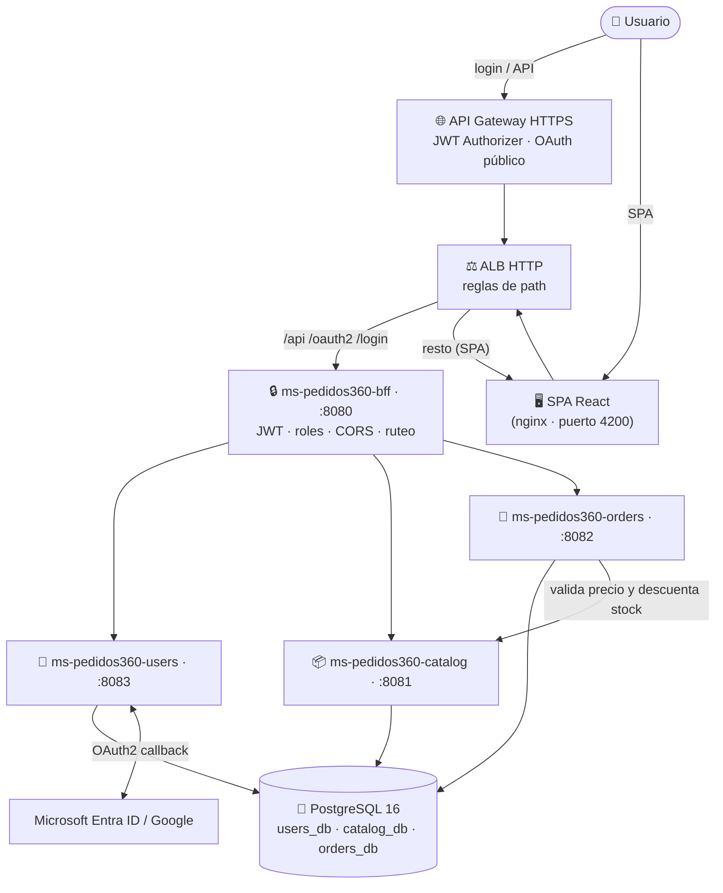

<div align="center">

# 🛒 Pedidos360

**E-commerce de supermercado con arquitectura de microservicios** — SPA en React, backend Java con 3 microservicios + BFF, login con **Microsoft Entra ID** y **Google**, y despliegue completo en **AWS** (API Gateway + ALB + EC2 + ECR).


</div>

---

## ✨ Qué es

**Pedidos360** es una plataforma de pedidos de supermercado completa: el cliente navega el catálogo, arma un carrito y crea órdenes; el **OPERADOR** gestiona el estado de las órdenes; y el **ADMIN** administra productos, categorías, usuarios y ve un dashboard con KPIs.

La autorización está **centralizada en un BFF** que valida el JWT emitido en el login (OAuth2 Authorization Code + PKCE) y enruta cada petición al microservicio correcto, separando **autenticación** (quién eres) de **autorización** (qué puedes hacer).

### 🧩 Características

| | |
|---|---|
| 🔐 **Login doble** | Microsoft Entra ID (con roles) y Google (siempre como **CLIENTE**) |
| 🎭 **3 roles** | `CLIENTE` · `OPERADOR` · `ADMIN`, mapeados desde los App Roles de Entra ID |
| 🛍️ **Catálogo** | Categorías y productos con foto por categoría, precio en CLP y stock |
| 🛒 **Carrito + órdenes** | Flujo completo hasta crear la orden; descuento de stock atómico |
| 📊 **Dashboard admin** | KPIs de venta, distribución por estado, top productos y clientes |
| 🏷️ **Estados legibles** | "En preparación" en vez de `EN_PREPARACION` en toda la UI |
| 🎨 **UI moderna** | Paleta violeta/fucsia, tarjetas y pills redondeadas, navbar con degradado |
| ☁️ **Cloud-native** | API Gateway con JWT Authorizer, ALB, EC2 (Docker) y ECR |

---

## 🏗️ Arquitectura



> **Regla de oro:** la aplicación solo habla con el **BFF** (o el gateway). Los puertos internos (8081–8083) se exponen únicamente para depuración. Los microservicios internos confían en la red interna; el BFF inyecta `X-User-Email` para las órdenes.

---

## 🧰 Stack tecnológico

| Capa | Tecnología |
|---|---|
| 🖥️ **Frontend** | React 18 · React Router · Vite · nginx (producción) |
| ☕ **Backend** | Java 21 · Spring Boot 3 · Spring Security · Maven |
| 🗄️ **Persistencia** | PostgreSQL 16 · Spring Data JPA (una DB por microservicio) |
| 🔐 **Seguridad** | Spring Authorization Server (OAuth2 client) · JWT HS256 · tokens por query |
| 🐳 **Entrega** | Docker · Docker Compose · AWS ECR / EC2 |
| ☁️ **AWS** | API Gateway HTTP (v2) · Lambda (JWT Authorizer) · ALB · SSM |

---

## 🗂️ Estructura del proyecto

```
📁 project-cloud-native-ev1-dev
├── 📦 FRONTEND/                  # SPA React + Vite (nginx en prod)
│   ├── src/pages/                # Login, catálogo, carrito, mis pedidos
│   │   └── admin/                # Dashboard KPIs, productos, órdenes, usuarios
│   ├── src/api/                  # Clientes HTTP (auth, catalog, orders)
│   ├── src/auth/                 # AuthContext + guards por rol
│   └── src/utils/orderStatus.ts  # Util compartida de estados legibles
├── ☕ ms-pedidos360-bff/          # Gateway: JWT, roles, CORS y ruteo (public :8080)
├── ☕ ms-pedidos360-users/        # Usuarios, login OAuth2, emisión de JWT (:8083)
├── ☕ ms-pedidos360-catalog/      # Categorías, productos y stock (:8081)
├── ☕ ms-pedidos360-orders/       # Órdenes y reglas de negocio (:8082)
├── 🐳 docker-compose.yml         # Orquestación local
├── 🐳 docker/postgres/init.sql   # Crea users_db, catalog_db y orders_db
├── ☁️ aws/                       # Despliegue cloud
│   ├── api-gateway.yaml          # API Gateway + Lambda authorizer (CloudFormation)
│   ├── userdata-backend.sh       # Bootstrap de la EC2 (Docker + seed UTF-8 seguro)
│   ├── genjwt.js                 # Generador de JWT de prueba
│   └── README.md                 # Guía completa del despliegue AWS
└── 📄 .env.example               # Plantilla de variables (sin secretos)
```

---

## 📦 Componentes

| Componente | Puerto (interno) | Base de datos | Función |
|---|:---:|---|:---|
| **FRONTEND** (React + Vite) | 4200 | — | SPA: catálogo, carrito, órdenes y panel admin |
| **ms-pedidos360-bff** | 8080 `público` | — | Valida JWT y roles, CORS y enruta a los servicios internos |
| **ms-pedidos360-users** | 8083 | `users_db` | Usuarios, OAuth2 con Entra ID/Google y emisión de JWT |
| **ms-pedidos360-catalog** | 8081 | `catalog_db` | CRUD de categorías y productos, control de stock |
| **ms-pedidos360-orders** | 8082 | `orders_db` | Órdenes, estados y descuento de stock contra catálogo |

> 🐘 **Base de datos:** un mismo PostgreSQL con **una base por microservicio** (`users_db`, `catalog_db`, `orders_db`) — independencia de datos con footprint mínimo.

---

## 🚀 Empezando

### Requisitos

- Docker Desktop (con Docker Compose)
- Node.js 22+ (solo si corres el frontend sin Docker)
- Java 21 + Maven (solo si corres los microservicios sin Docker)

### 1️⃣ Con Docker (recomendado)

```bash
# 1. Copia la plantilla y completa los valores (sin secretos reales en git)
cp .env.example .env

# 2. Levanta PostgreSQL + los 5 servicios
docker compose up --build
```

Una vez arriba:

| Recurso | URL |
|---|---|
| 🖥️ Aplicación web | http://localhost:4200 |
| 🔌 BFF (único punto de entrada de la API) | http://localhost:8080 |
| 🔐 Login Microsoft (OAuth2) | http://localhost:8080/oauth2/authorization/azure |
| 📦 Catálogo (vía BFF) | http://localhost:8080/api/catalog/products |

> Las variables requeridas en `.env`: `JWT_SECRET`, `AZURE_CLIENT_ID`, `AZURE_CLIENT_SECRET`, `AZURE_TENANT_ID`. `SPA_BASE_URL` define a dónde redirige el backend tras el login (por defecto `http://localhost:4200`).

```bash
# Parar todo
docker compose down

# Reset total (borra las bases de datos)
docker compose down -v
```

### 2️⃣ Sin Docker (dev)

Cada microservicio necesita su base en PostgreSQL y un `.env` con los valores local:

```bash
cd ms-pedidos360-bff        && ./mvnw spring-boot:run   # :8080
cd ms-pedidos360-users      && ./mvnw spring-boot:run   # :8083
cd ms-pedidos360-catalog    && ./mvnw spring-boot:run   # :8081
cd ms-pedidos360-orders     && ./mvnw spring-boot:run   # :8082
cd FRONTEND                 && npm install && npm run dev
```

---

## 🔐 Autenticación y roles

### Roles

| Rol | ¿Quién lo tiene? | Qué puede hacer |
|---|---|---|
| 👤 **CLIENTE** | Registro local, o login por **Google** (siempre) | Comprar, ver sus órdenes y su perfil |
| 🧑‍🔧 **OPERADOR** | App role de Entra ID `OPERADOR` | Cambiar el estado de cualquier orden |
| 🛡️ **ADMIN** | App role de Entra ID `ADMIN` | Todo lo del OPERADOR + CRUD de catálogo, usuarios y dashboard KPIs |

> **Google siempre entra como `CLIENTE`** (OAuth2 no trae claim de roles). Microsoft, en cambio, mapea el claim `roles` del token usando `AZURE_ROLE_ADMIN_ID`, `AZURE_ROLE_OPERADOR_ID` y `AZURE_ROLE_CLIENTE_ID` (por defecto, el **VALUE** del App Role: `CLIENTE`/`OPERADOR`/`ADMIN`).

### Matriz de autorización (BFF)

| Ruta | Público | Autenticado | OPERADOR | ADMIN |
|---|:---:|:---:|:---:|:---:|
| `/oauth2/**` · `/login/oauth2/**` · `/api/auth/**` | ✅ | — | — | — |
| `GET /api/catalog/**` | — | ✅ | ✅ | ✅ |
| `GET /api/users/profile` | — | ✅ | ✅ | ✅ |
| `GET/POST /api/orders` · `GET /api/orders/{id}` | — | ✅ | ✅ | ✅ |
| `PUT /api/orders/{id}/status` | — | — | ✅ | ✅ |
| `POST/PUT/PATCH/DELETE /api/catalog/**` | — | — | — | ✅ |
| `GET /api/users` | — | — | — | ✅ |

### Configurar roles en Microsoft Entra ID (una sola vez)

1. **Portal de Azure → App registrations → tu app → App roles** → crea 3 app roles con *values* `CLIENTE`, `OPERADOR` y `ADMIN` (pueden ser solo para "Members" de tu app).
2. **Enterprise applications → tu app → Users and groups** → asigna usuarios a los roles.
3. Si falta **admin consent**, entrégalo desde la vista de Enterprise application del tenant.
4. Vuelve a iniciar sesión (pestaña de incógnito) para que el token traiga el nuevo claim `roles`.

> 🔎 La verificación de roles (login ADMIN/OPERADOR real) se documenta en `EP1-CHECKLIST.md`.

---

## 📡 API (a través del BFF)

### Auth y usuarios

| Método | Ruta | Acceso | Descripción |
|---|---|---|---|
| `POST` | `/api/auth/register` | público | Crea usuario local (`name`, `email`, `password`) |
| `POST` | `/api/auth/login` | público | Login local → devuelve JWT |
| `GET` | `/api/users/profile` | autenticado | Perfil del usuario actual |
| `GET` | `/api/users` | ADMIN | Lista de usuarios |

### Catálogo

| Método | Ruta | Acceso | Descripción |
|---|---|---|---|
| `GET` | `/api/catalog/products?categoryId=` | autenticado | Productos (con filtro por categoría) |
| `GET` | `/api/catalog/products/{id}` | autenticado | Detalle de un producto |
| `POST` | `/api/catalog/products` | ADMIN | Crea producto |
| `PUT` | `/api/catalog/products/{id}` | ADMIN | Actualiza producto |
| `PATCH` | `/api/catalog/products/{id}/stock` | ADMIN | Ajusta stock |
| `DELETE` | `/api/catalog/products/{id}` | ADMIN | Elimina producto |
| `GET/POST/PUT/DELETE` | `/api/catalog/categories[/{id}]` | GET: autenticado<br/>resto: ADMIN | CRUD de categorías |

### Órdenes

| Método | Ruta | Acceso | Descripción |
|---|---|---|---|
| `POST` | `/api/orders` | autenticado | Crea orden (descuenta stock del catálogo) |
| `GET` | `/api/orders` | autenticado | Órdenes del usuario actual |
| `GET` | `/api/orders/{id}` | autenticado | Detalle (solo de órdenes propias) |
| `PUT` | `/api/orders/{id}/status` | OPERADOR/ADMIN | Cambia el estado (`CREADO` → `ACEPTADO` → `EN_PREPARACION` → `DESPACHADO` → `ENTREGADO`, o `CANCELADO`) |
| `GET` | `/api/orders/all` | autenticado* | Todas las órdenes (la UI solo lo usa en vistas admin/operación) |

> El BFF agrega los headers `X-Forwarded-*` y `X-User-Email` automáticamente.

---

## 🖥️ Frontend

| Ruta | Acceso | Descripción |
|---|:---:|---|
| `/login` | público | Login/registro local + botones Microsoft/Google |
| `/auth/callback` | público | Guarda el JWT devuelto por OAuth2 y entra |
| `/` | autenticado | Catálogo con filtro por categoría y alta al carrito |
| `/carrito` | autenticado | Cantidades, total (CLP) y creación de la orden |
| `/mis-pedidos` | autenticado | Órdenes del usuario con estados legibles |
| `/operacion/ordenes` | OPERADOR/ADMIN | Cambio de estado de cualquier orden |
| `/admin` | ADMIN | **Dashboard con KPIs** (ventas, distribución por estado, top productos) |
| `/admin/productos` | ADMIN | CRUD de productos y categorías |
| `/admin/ordenes` | ADMIN | Gestión de órdenes (alias del panel de operación) |
| `/admin/usuarios` | ADMIN | Listado de usuarios |

**Flujo OAuth2:** la SPA navega a `/oauth2/authorization/{azure|google}` → el IdP autentica → redirige al callback → `ms-pedidos360-users` emite el JWT y redirige a `${SPA_BASE_URL}/auth/callback?token=…`, donde la SPA guarda el token y navega al catálogo. El JWT viaja en `localStorage` y se envía como `Authorization: Bearer`.

---

## ☁️ Despliegue en AWS

```
Usuario ──► API Gateway HTTPS (JWT Authorizer + rutas OAuth públicas)
                 │
                 ▼
              ALB HTTP ──┬─ /api /oauth2 /login ──► BFF :8080  (EC2 · Docker)
                         └─ resto (SPA) ──────────► nginx :4200 (EC2 · Docker)
```

| Recurso | Detalle |
|---|---|
| 🌐 **API Gateway** | `https://821dbjhp16.execute-api.us-east-1.amazonaws.com/prod` — JWT authorizer (Lambda HS256) + OAuth público |
| ⚖️ **ALB** | `http://pedidos360-alb-571995876.us-east-1.elb.amazonaws.com` — reglas de path `/api|/oauth2|/login` → BFF; resto → SPA |
| 🖥️ **EC2** | `i-035eb3939d3abbf02` — Docker: frontend (nginx :4200), bff (:8080), users (:8083), catalog (:8081), orders (:8082), db |
| 📦 **ECR** | `324523428924.dkr.ecr.us-east-1.amazonaws.com/pedidos360-*` (frontend se publica como tag `:prod`) |

**Desplegar el frontend (restyle/UI):**

```bash
REG=324523428924.dkr.ecr.us-east-1.amazonaws.com
aws ecr get-login-password --region us-east-1 | docker login --username AWS --password-stdin $REG
docker build -f FRONTEND/Dockerfile.prod \
  --build-arg VITE_PUBLIC_BFF_URL=https://821dbjhp16.execute-api.us-east-1.amazonaws.com/prod \
  -t $REG/pedidos360-frontend:prod FRONTEND
docker push $REG/pedidos360-frontend:prod
# En la EC2: docker pull + docker rm -f pedidos360-frontend + docker run (ver aws/userdata-backend.sh)
```

**Levantar el backend en una EC2 nueva:** el script `aws/userdata-backend.sh` instala Docker, levanta los 6 contenedores y **siembra el catálogo** (5 categorías + 18 productos) con `PGCLIENTENCODING=UTF8` para garantizar UTF-8 correcto.

**Publicar el API Gateway:** sección completa paso a paso (incluido el authorizer y los curl de prueba) en [`aws/README.md`](aws/README.md).

> 🔧 **Herramienta:** `aws/genjwt.js` genera un JWT HS256 de prueba con la misma `JWT_SECRET` para emular cualquier rol:
> ```bash
> node aws/genjwt.js "<JWT_SECRET>" "ADMIN" "admin@tudominio.cl"
> ```

---

## ⚙️ Variables de entorno

| Variable | Obligatoria | Descripción |
|---|---|:---:|
| `JWT_SECRET` | ✅ | Secreto HS256 **idéntico** en users, bff y parámetro `JwtSecret` del stack |
| `JWT_EXPIRATION` | | Validez del JWT (ms). Default `86400000` (24 h) |
| `DB_USER` / `DB_PASSWORD` | | Credenciales PostgreSQL (una DB por servicio) |
| `AZURE_CLIENT_ID` / `AZURE_CLIENT_SECRET` / `AZURE_TENANT_ID` | ✅ | App Registration de Entra ID |
| `AZURE_REDIRECT_URI` | ✅ | `http://localhost:8080/login/oauth2/code/azure` (web: la del gateway) |
| `SPA_BASE_URL` | ✅ | A dónde redirige users tras el login (`http://localhost:4200` o el ALB) |
| `AZURE_ROLE_ADMIN_ID` / `AZURE_ROLE_OPERADOR_ID` / `AZURE_ROLE_CLIENTE_ID` | | Value del App Role a mapear (default: `ADMIN`/`OPERADOR`/`CLIENTE`) |
| `GOOGLE_CLIENT_ID` / `GOOGLE_CLIENT_SECRET` / `GOOGLE_REDIRECT_URI` | | Opcionales; vacíos ⇒ Google deshabilitado (los usuarios Google entran como CLIENTE) |

> 🔒 Los secretos reales **nunca** se versionan: `.env` está en `.gitignore`. El repo solo contiene `.env.example` con placeholders.

---

## 🐛 Solución de problemas

| Problema | Causa / Fix |
|---|---|
| **"Azúcar", "Tecnología"** (acentos rotos) | Mojibake por doble codificación en el seed. Fix: `PGCLIENTENCODING=UTF8` en el seed + corregir con `convert_from(convert_to(col,'LATIN1'),'UTF8')` sobre las filas afectadas |
| **Pantalla blanca tras desplegar el frontend** | Hashes de Vite cambiaron; el navegador cachea módulos viejos → recarga forzada `Ctrl+Shift+R` |
| **401 intermitente "Token inválido o expirado"** | Clock skew entre tu PC y la EC2 → `JWT_CLOCK_SKEW_SECONDS=60` en la EC2 (default 30 s) |
| **`authorization_request_not_found` al hacer login** | Se inició el login por la ruta relativa del proxy en vez de la URL absoluta del BFF (cookie `JSESSIONID` en dominio distinto). Usar `VITE_PUBLIC_BFF_URL` absoluta |
| **Login OAuth en la web lanza 302 directo a Microsoft** | Registra la redirect URI pública del gateway en la App Registration (y en Google Cloud Console) |
| **Token no trae rol** | El claim `roles` solo viene al volver a iniciar sesión tras la asignación de app roles en Entra ID |

---

<div align="center">

**Hecho con 💜 para la Evidencia EP1** · Microservicios · OAuth2 · Cloud-native · React

</div>